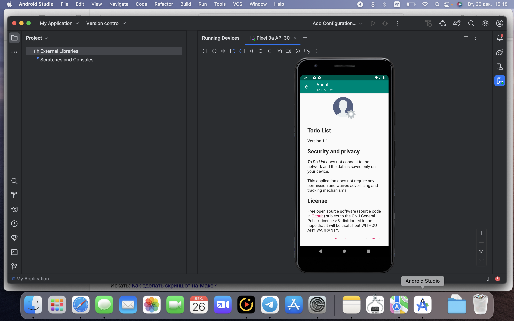

# Android Studio

Android Studio is the official Integrated Development Environment (IDE) for Android app development. 

Android Studio, an emulator, which allows to build and run apps both on virtual and hardware devices. By means of Android Stiduo, we can use the following features in testing purposes:
- create and manage android virtual devices
- test on multiple screen sizes
- emulate gestures and common actions
- take screenshots
- record the screen
- use a camera
- install and add .apk files
- view logs with Logcat, etc.

<a href="https://developer.android.com/studio" target="_blank">Link</a> to download Android Studio

#### Here are results of ToDoList mobile app testing using Android studio emulator:

Here is ToDoList app built in Android Studio using .apk file:

<a href="https://github.com/DariaMartinovskaya/Android_Studio/blob/main/App%20logs%20in%20Android%20Studio.md" target="_blank">Here</a> is steps description how to collect app logs from a connected android device in Android Studio

<a href="https://github.com/DariaMartinovskaya/Android_Studio/blob/main/ToDoList_logs.txt" target="_blank">Here</a> are ToDoList app logs collected using Android Studio
